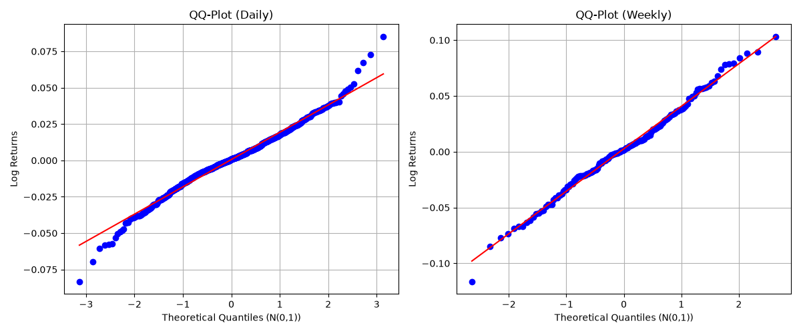
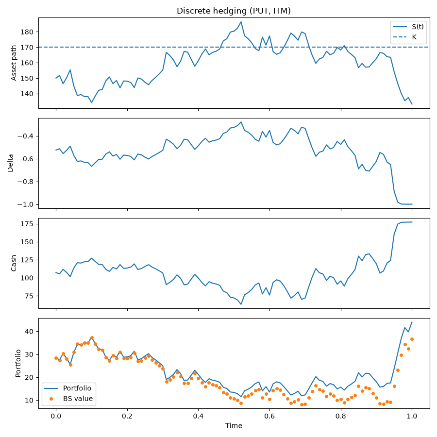
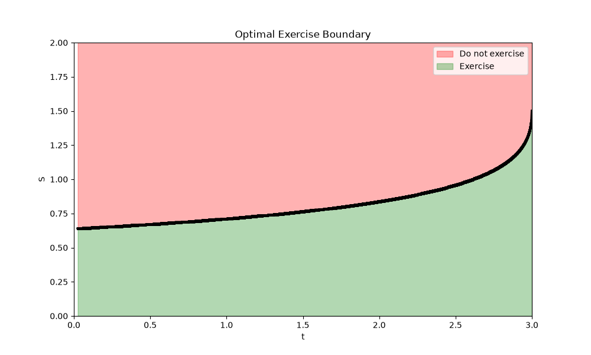
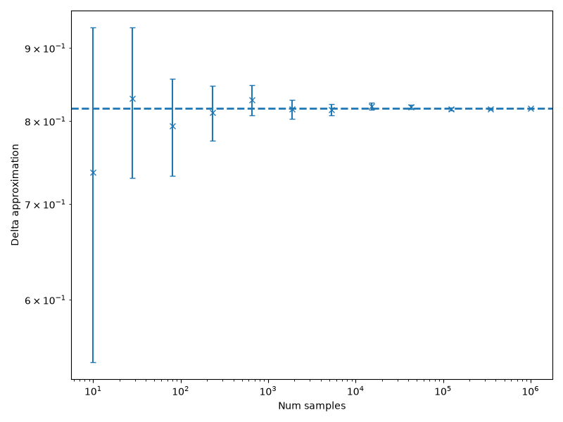
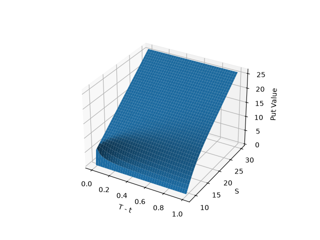

# Option Pricing & Stochastic Simulation

A collection of eight self-contained studies in quantitative finance, moving
from empirical return statistics up through Black-Scholes delta hedging,
implied volatility extraction, binomial/Bermudan option trees, Monte Carlo
pricing of exotic (Asian, lookback, snowball) options, and finite-difference
PDE solvers. Originally developed as coursework across two assignments in a
stochastic calculus / option valuation module, refactored here into a clean,
runnable project.

Everything is plain NumPy/SciPy/Matplotlib — no pricing libraries — so the
math is fully visible in the code.

## Contents

| # | Topic | Script | Concepts |
|---|-------|--------|----------|
| 1 | [Market stock prices & return distributions](#1-market-stock-prices--return-distributions) | `src/returns_analysis.py` | simple vs. log returns, sample moments, QQ-plots |
| 2 | [Central Limit Theorem](#2-central-limit-theorem) | `src/clt_verification.py` | sampling distribution of the mean |
| 3 | [GBM path simulation](#3-gbm-path-simulation) | `src/gbm_simulation.py` | Euler discretization, lognormal convergence |
| 4 | [Delta hedging & Black-Scholes](#4-delta-hedging--black-scholes) | `src/delta_hedging.py` | PDE derivation, discrete replication |
| 5 | [Implied volatility](#5-implied-volatility) | `src/implied_volatility.py` | bisection solver, smile, term structure |
| 6 | [Binomial American & Bermudan puts](#6-binomial-american--bermudan-puts) | `src/binomial_american_bermudan.py` | CRR tree, early-exercise boundary |
| 7 | [Exotic options via Monte Carlo](#7-exotic-options-via-monte-carlo) | `src/exotic_options_mc.py` | Asian/lookback puts, MC Delta, snowball note |
| 8 | [Finite-difference PDE solvers](#8-finite-difference-pde-solvers) | `src/pde_finite_difference.py` | BTCS, Crank-Nicolson, barrier option |

## Setup

```bash
pip install -r requirements.txt
python src/fetch_data.py      # downloads AAPL daily/weekly OHLC via yfinance -> data/
```

Each `src/*.py` file can then be run standalone; figures are written to
`results/q1` ... `results/q8`.

```bash
python src/returns_analysis.py
python src/clt_verification.py
python src/gbm_simulation.py
python src/delta_hedging.py
python src/implied_volatility.py
python src/binomial_american_bermudan.py
python src/exotic_options_mc.py
python src/pde_finite_difference.py
```

## Project structure

```
option-pricing-simulations/
├── data/                    # input CSVs (fetched or provided)
├── results/                 # generated figures, one subfolder per topic
└── src/
    ├── fetch_data.py
    ├── returns_analysis.py
    ├── clt_verification.py
    ├── gbm_simulation.py
    ├── delta_hedging.py
    ├── implied_volatility.py
    ├── binomial_american_bermudan.py
    ├── exotic_options_mc.py
    └── pde_finite_difference.py
```

---

## 1. Market stock prices & return distributions

Loads AAPL daily and weekly close prices and computes two return measures:

```
simple return:   r_i     = (S_i - S_{i-1}) / S_i
log return:      r_hat_i = ln(S_i / S_{i-1})
```

The two coincide whenever `ln(1 + r) ≈ r`, i.e. for small per-period moves —
they diverge visibly only around large single-day jumps.

Sample mean and (unbiased, `ddof=1`) variance of the daily log returns are
computed, followed by a histogram and a QQ-plot against `N(0,1)`. The same
diagnostics are repeated on weekly-aggregated data:

<p align="center">
  
</p>

The weekly QQ-plot tracks the theoretical normal line noticeably better than
the daily one — a direct empirical illustration of the Central Limit Theorem
(weekly returns are effectively 5-day sums of daily returns, so their
distribution is closer to Gaussian than the daily returns themselves, which
show the fat tails typical of financial data).

## 2. Central Limit Theorem

A synthetic check of the CLT, independent of any market data: samples of
size `n` are drawn from a uniform population and the sampling distribution
of the mean is compared, for `n = 5, 30, 100`, against:

```
N(mu, sigma / sqrt(n))
```

As `n` increases the empirical sampling distribution converges to this
Gaussian regardless of the (non-normal) shape of the underlying population.

## 3. GBM path simulation

Simulates the Euler discretization of geometric Brownian motion:

```
S(t_{i+1}) = S(t_i) * (1 + mu*dt + sigma*sqrt(dt)*Z),   Z ~ N(0, 1)
```

with `S_0 = 170`, `mu = 0.1`, `sigma = 0.344`, `T = 1`. A single path is
plotted at coarse resolution (`L = 5`), then `M = 5000` terminal values
`S_T` are simulated and histogrammed for `L = 10, 20, 50, 100` and compared
against the exact GBM solution:

```
S_T = S_0 * exp((mu - 0.5*sigma^2)*T + sigma*sqrt(T)*Z)
```

As `L` grows, the Euler scheme's discretization error shrinks and the
simulated histogram converges onto the theoretical lognormal curve. A
secondary check tracks the running sum of squared log-returns along each
path and confirms it approaches the theoretical quadratic variation
`sigma^2 * T`.

## 4. Delta hedging & Black-Scholes

**Derivation.** Starting from a self-financing portfolio of `A` shares (paying
continuous dividend yield `q`) plus a cash account `D`, matching its
instantaneous change to that of a derivative `V` via Itô's lemma and a
no-arbitrage argument yields the Black-Scholes PDE with dividends:

```
V_t + (r - q) S V_s + 0.5 sigma^2 S^2 V_ss - r V = 0
```

**Discrete hedge.** At each rebalancing step the portfolio is rolled forward
one period (earning interest `r` on cash and dividend yield `q` on the
stock position), then re-hedged to the option's new delta:

```
Pi_{i+1} = A_i S_{i+1} + (1 + r*dt) D_i + q A_i S_i dt
A_{i+1}  = dV_{i+1}/dS
D_{i+1}  = (1 + r*dt) D_i + (A_i - A_{i+1}) S_{i+1} + q A_i S_i dt
```

`delta_hedging.py` runs this for a European put (`E = S_0 = 170`, `T = 1`,
`r = 0.05`, `sigma = 0.344`, `q = 0.01`, `dt = 0.01`) along one in-the-money
and one out-of-the-money price path:

<p align="center">
  
</p>

The bottom panel compares the replicating portfolio's value against the
Black-Scholes price at every step — the close tracking (up to discretization
error) is the empirical content of the no-arbitrage argument.

**Terminal check (Eq. 9.9).** Running `M = 1000` simulated paths and comparing

```
Pi(S_T, T) + (P(S_0, 0) - Pi(S_0, 0)) * e^{rT}
```

against the option's actual payoff `max(K - S_T, 0)` shows the two collapse
onto the same curve, and doing this for `mu = +0.10` and `mu = -0.10`
produces statistically indistinguishable hedge-error distributions —
confirming that the hedge's effectiveness does not depend on the real-world
drift used to simulate the stock, only on `sigma`.

## 5. Implied volatility

Given a small chain of LULU call quotes (`data/lulu_options.csv`, bid/ask
mid-prices, various strikes and expiries), a bisection solver inverts the
Black-Scholes formula for `sigma` at each quote, producing:

- an **IV smile** (implied vol vs. strike), and
- a **term structure** (implied vol vs. time to maturity).

With only a handful of illiquid, noisy quotes across mixed expiries the
resulting curves are noisy rather than the smooth, monotone smile one would
see with a deep, liquid chain (e.g. index options) — a useful reminder that
implied-volatility surfaces are only as clean as the underlying option
market's liquidity.

## 6. Binomial American & Bermudan puts

A Cox-Ross-Rubinstein (CRR) binomial tree is used to value an American
put (`S = 1`, `E = 1.5`, `T = 3`, `r = 0.01`, `sigma = 0.3`, `M = 10000`
steps). Up/down factors and the risk-neutral probability are

```
u = e^(sigma*sqrt(dt))
d = e^(-sigma*sqrt(dt))
p = (e^(r*dt) - d) / (u - d)
```

At every node the immediate exercise value is compared against the
continuation (discounted expected future) value, and the larger of the two
is taken as the option value — stepping this back from `T` to `0` gives the
American price, **0.5531**. Tracking, at each step, the asset level where
exercising first becomes optimal traces out the optimal exercise boundary:

<p align="center">
  
</p>

Restricting early exercise to a fixed grid of `[3, 6, 12, 36]` equally spaced
dates (instead of every step) prices the corresponding **Bermudan** put:

| Exercise dates | Value |
|---|---|
| 3  | 0.5498 |
| 6  | 0.5515 |
| 12 | 0.5523 |
| 36 | 0.5529 |

As the number of early-exercise dates increases, the Bermudan value
converges towards the American value (0.5531) — exactly as expected, since
the American put is the limit of a Bermudan put as the exercise grid is
refined to every step.

## 7. Exotic options via Monte Carlo

Adjusts a standard Monte Carlo option pricer (simulate many GBM price paths,
discount the average payoff) for two path-dependent payoffs, both using
antithetic paths for variance reduction:

```
Asian put:     v = e^(-rT) * max(E - S_avg, 0)
Lookback put:  v = e^(-rT) * max(E - S_min, 0)
```

With `S = 1`, `E = 1.2`, `sigma = 0.3`, `r = 0.01`, `T = 1`, 52 weekly
monitoring dates and 10,000 simulations:

| Option | Mean | 95% CI | Antithetic mean | 95% CI |
|---|---|---|---|---|
| Asian put | 0.2079 | [0.2051, 0.2108] | 0.2094 | [0.2090, 0.2097] |
| Lookback put | 0.3882 | [0.3854, 0.3909] | 0.3891 | [0.3882, 0.3900] |

**Delta.** Since `Delta = dV/dS`, the Asian put's Delta is estimated by
bumping the initial price by a small `h = 0.001`, repricing on the *same*
Brownian path, and differencing — again combined with antithetic sampling.
This gives **Mean Delta: -0.8172** (standard error 0.0027). Repeating the
estimate across an increasing number of paths and comparing to a
high-sample reference value shows the usual Monte Carlo convergence:

<p align="center">
  
</p>

**Snowball note.** A path is simulated with `n = 12` monitoring dates; each
time the asset stays within `[0.8, 1.2]` the payoff steps up by `dA = 0.2`
from a base of `A0 = 1.0`. Monte Carlo pricing gives **Mean: 2.6066**,
95% CI **[2.5936, 2.6196]**.

## 8. Finite-difference PDE solvers

**European put (BTCS).** Substituting `x = ln(S)` turns the Black-Scholes
PDE into a constant-coefficient diffusion equation, solved here with a
backward-time-centered-space (fully implicit) scheme over `x` in
`[ln(1e-4), ln(4E)]`, with

```
u(x, 0)   = max(E - e^x, 0)
u(0, tau) = E e^(r*tau)
u(L, tau) = 0
```

For `S0 = 10`, `E = 10`, `r = 0.01`, `sigma = 0.3`, `T = 1`, the resulting
European put price is **1.1210**.

**Down-and-out call (Crank-Nicolson).** A Crank-Nicolson scheme solves the
Black-Scholes PDE with dividend yield `q` directly in `S`-space over
`[B, Smax]`, with the option value pinned to zero at the barrier `S = B`
(knocked out) and a linear boundary condition at `Smax`. For `E = 4`,
`S0 = 10`, `B = 9`, `sigma = 0.3`, `r = 0.01`, `q = 0.005`, `T = 1`, the
time-zero value is **6.05**:

<p align="center">
  
</p>

---

## Notes & limitations

- AAPL price history is fetched fresh via `yfinance` in `fetch_data.py`
  rather than checked into the repo, so figures will vary slightly by
  fetch date/range.
- The LULU option quotes are a small, manually captured snapshot — good
  enough to demonstrate the IV-extraction machinery, not to draw
  conclusions about LULU's actual volatility surface.
- All simulations assume constant volatility and drift (plain GBM); no
  stochastic-volatility or jump dynamics are modeled.
- `exotic_options_mc.py` calls `asian()`, `lookback()`, `delta()`, and
  `snowball_option()` back-to-back under a single fixed seed, so each one
  consumes the random stream where the previous left off. Numbers therefore
  reproduce run-to-run but won't match the report figures to the last
  decimal (which were generated by running each part in isolation) — they
  agree to within ordinary Monte Carlo noise for `M = 10000` paths.
- Question 1(c) of the second assignment (trinomial tree convergence) was
  not completed in the original coursework and is not implemented here.
